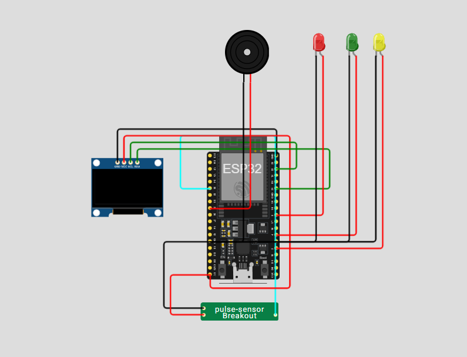

as referências deixe diferente t# 🫀 Monitor Cardíaco com ESP32

Este projeto utiliza o **ESP32 DevKit C V4** para monitorar batimentos cardíacos em tempo real, exibindo informações em um **OLED 128x64** e acionando alertas visuais e sonoros conforme a frequência detectada. Além disso, os dados são enviados via **MQTT** para monitoramento remoto.

---

## 🔧 Componentes Utilizados

- ESP32 DevKit C V4  
- Sensor de pulso (simulado via pino analógico 35)  
- OLED 128x64 I2C  
- LEDs indicadores:
  - 🔴 LED Vermelho: ritmo elevado  
  - 🟢 LED Verde: ritmo normal  
  - 🟡 LED Amarelo: ritmo abaixo do ideal  
- Buzzer para alerta sonoro  
- Rede Wi-Fi e Broker MQTT (`test.mosquitto.org`)

---

## ⚙ Funcionamento

1. **Leitura do sensor**: o ESP32 lê o valor do pulso no pino analógico e converte para BPM (batimentos por minuto).  
2. **Classificação do ritmo**:
   - BPM ≤ 50 → Ritmo Abaixo do Ideal 🟡  
   - BPM entre 51 e 119 → Ritmo Estável 🟢  
   - BPM ≥ 120 → Ritmo Elevado 🔴  
3. **Acionamento de alertas**:
   - LED correspondente acende  
   - Buzzer dispara quando o ritmo está fora do normal  
4. **Exibição OLED**: mostra BPM e estado do ritmo em tempo real  
5. **Envio MQTT**: dados são publicados nos tópicos:
   - `monitor/cardiaco/valor`  
   - `monitor/cardiaco/estado`

---

## 🧪 Testes Realizados

- ✅ Leitura do sensor: respostas consistentes e precisas do BPM  
- ✅ LEDs: acionam corretamente conforme faixa de BPM  
- ✅ Buzzer: alerta sonoro funcionando para BPM fora da faixa normal  
- ✅ OLED: valores exibidos claramente e atualizados em tempo real  
- ✅ MQTT: conexão estável e envio correto dos dados para monitoramento remoto

---

## 💡 Possíveis Melhorias

- Armazenar histórico de BPM em banco de dados  
- Criar dashboard web ou app para visualização gráfica 📊  
- Notificações em smartphone para BPM fora da faixa ⚠️  
- Monitoramento simultâneo de múltiplos sensores

---

## 📚 Referências

- [Adafruit SSD1306 OLED Library](https://github.com/adafruit/Adafruit_SSD1306)  
- [PubSubClient MQTT Library for Arduino](https://pubsubclient.knolleary.net/)  
- [ESP32 DevKit-C V4 Technical Reference](https://www.espressif.com/)  
- [HiveMQ MQTT Broker Documentation](https://www.hivemq.com/)
